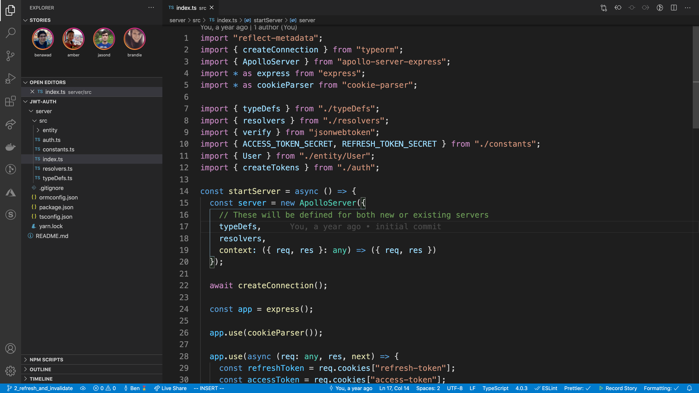
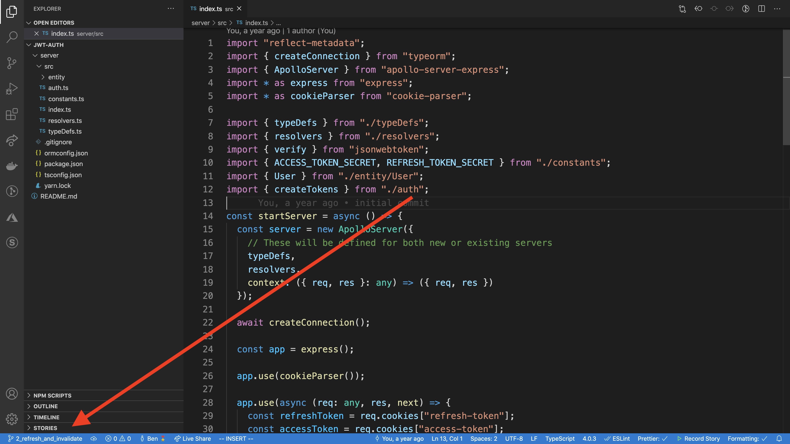
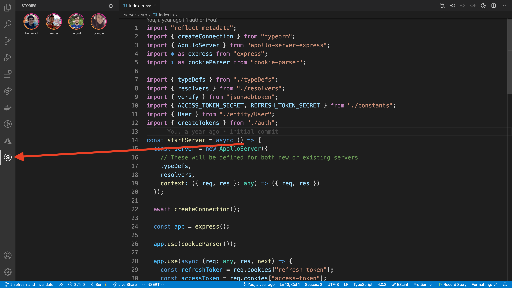
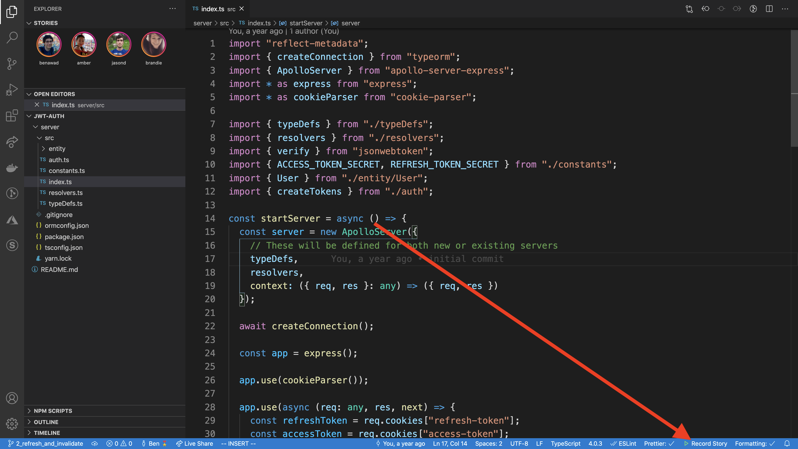

API: [https://github.com/benawad/vscode-stories-api](https://github.com/benawad/vscode-stories-api)
Serverless Image Uploader: [https://github.com/benawad/vscode-stories-serverless-image-uploader](https://github.com/benawad/vscode-stories-serverless-image-uploader)

## Stories for Visual Studio Code

## When you first install the panel will probably be at the bottom

## Alternatively, you can click the icon on the side for a full panel

## Recording

This uses ffmpeg, so if you don't have it on your computer it'll prompt you to download it. You can record for up to 30 seconds and it records anything in the viewport. This doesn't work on some Linux operating systems like Arch.

