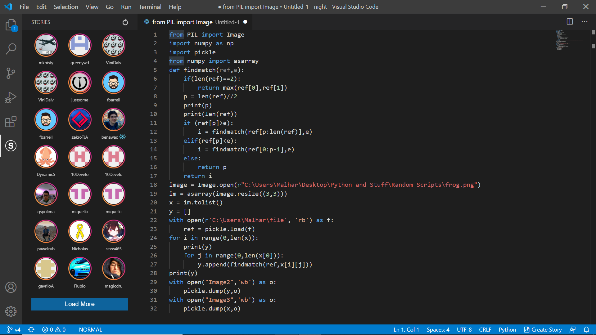
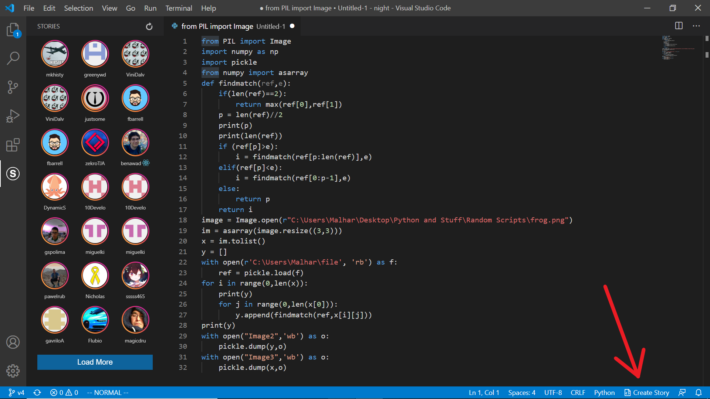

# Stories for Visual Studio Code

## **`code-peeking-made-easy`**

[**Stories**](https://marketplace.visualstudio.com/items?itemName=bar9.stories): a cool way of sharing code snippets with other developers.

## Getting Started

You can download Stories from the [VSCode Marketplace](https://marketplace.visualstudio.com/items?itemName=bar9.stories).

_or search `stories` in your VSCode Extensions_

Once you have it, you should see `stories` in VSCode similar to this:

## 2-Step Process to Create your own story

#### Step One

- You can click the Stories Icon button or open up the panel to access the stories.
- Once you have that open up, click on anyone's profile picture, and you'll be shown a snippet of their code of what they're currently working on, thus Stories!

## 

#### Step Two

- To upload your own story, click the Create Story button on the bottom right.

## 

_And voila, you published your very own VSCode Story!_

---

## For Enthusiastic Contributors

- <a href="https://discord.gg/ABpGdRxvaA">**Discord** Join Now!
  
  </a>

- If you are an enthusiastic open-source contributor, do read the guidelines before your PRs.
- All contributing guidelines are available _(at)_ [CONTRIBUTING.md](https://github.com/ide-stories/vscode-stories/blob/master/docs/CONTRIBUTING.md)
- Other documentations related to troubleshooting is [here](https://github.com/ide-stories/vscode-stories/tree/master/docs)

## Other code:

API: [https://github.com/ide-stories/vscode-stories-api](https://github.com/ide-stories/vscode-stories-api)

## Credits

- Thanks to [JessicaDosseh](https://github.com/JessicaDosseh) for her logo contribution
