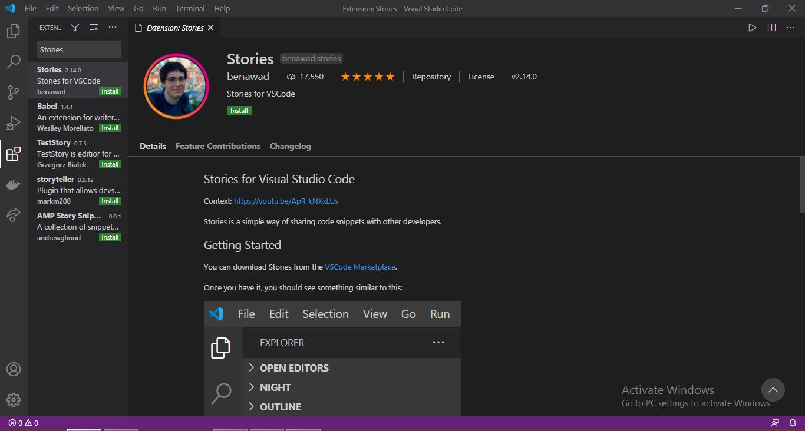

## Stories for Visual Studio Code

Context: [https://youtu.be/ApR-kNXxLUs](https://youtu.be/ApR-kNXxLUs)

Stories is a simple way of sharing code snippets with other developers.

## Getting Started

You can download Stories from the [VSCode Marketplace](https://marketplace.visualstudio.com/items?itemName=benawad.stories).

Once you have it, you should see something similar to this:


You can click the button or open up the panel to access the stories. Once you have that open up, you can click on anyone's profile picture, and you'll be shown a file of what they're currently working on!


To upload your own story, click the Create Story button on the bottom right.


And you've just uploaded your very own story!

## Install this extension in VS Code
 Click on the Extenstions Icon appear on the Left side panel <strong> OR </strong> Press ```Ctrl + Shift + X```
 
 Then Search for <b>Stories</b> at the Search bar
 
 It seems like this 👉 
 
 <br/> 
 
  Download and Enjoy 🥳 🎉 !!
## Other code

API: [https://github.com/benawad/vscode-stories-api](https://github.com/benawad/vscode-stories-api)

Serverless Image Uploader: [https://github.com/benawad/vscode-stories-serverless-image-uploader](https://github.com/benawad/vscode-stories-serverless-image-uploader)
